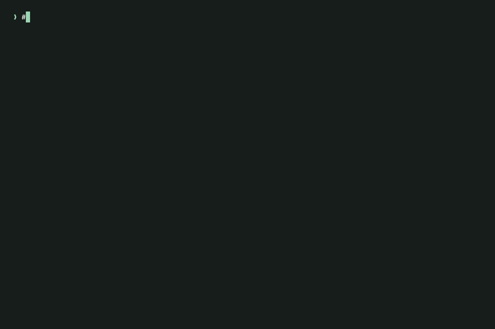

<p align="center">
  
</p>
<h1 align="center">vrdx</h1>
<p align="center"><strong>Keep the decision. Keep the why.</strong></p>
<p align="center">Engineering decisions in Markdown. A Rust CLI for people and AI, with a local dashboard.</p>
<p align="center">
  <a href="#start-here">Get started</a> ·
  <a href="#see-the-bigger-picture">Dashboard</a> ·
  <a href="docs/ai-guide.md">AI guide</a> ·
  <a href="docs/format.md">File format &amp; JSON</a>
</p>

---

<p align="center">
  
</p>

Decisions outlive the conversations that produced them. vrdx keeps the choice, reasoning, trade-offs and replacement history together in files your team can read, review and carry to another tool.

- **Markdown is the source.** Read it in any editor, review it in Git, rebuild the graph at any time.
- **History stays connected.** Stable IDs survive renames; explicit relationships show what replaced what.
- **People and agents share the evidence.** Browse a local dashboard, query the CLI or retrieve structured context with source paths and lifecycle status.

No database, account or external AI service. One native Rust binary.

## Start here

With Homebrew on macOS or Linux:

```sh
brew install niklas-heer/tap/vrdx
```

This installs the native executable; no Rust toolchain is needed. On macOS,
use macOS 15 or newer. Linux binaries target Ubuntu 24.04 or compatible systems
with glibc 2.39 or newer. Both Apple/ARM and Intel/AMD processors are supported.

Or download a standalone binary:

Download the archive for your operating system and processor from
[GitHub Releases](https://github.com/niklas-heer/vrdx/releases/latest), together
with `SHA256SUMS`. Each archive contains the executable, this README and the MIT
license. No Rust toolchain is needed to run it.

| System | Archive target |
| --- | --- |
| Linux, Intel/AMD 64-bit | `x86_64-unknown-linux-gnu` |
| Linux, ARM 64-bit | `aarch64-unknown-linux-gnu` |
| macOS, Apple Silicon | `aarch64-apple-darwin` |
| macOS, Intel | `x86_64-apple-darwin` |

Verify the downloaded archive against its entry in `SHA256SUMS` using
`sha256sum` on Linux or `shasum -a 256` on macOS. Extract it, then put `vrdx` in
a directory on your `PATH`, such as `~/.local/bin`. Run `vrdx --version` and
`vrdx guide` to check the installation. Linux releases are tested on Ubuntu
24.04 and macOS releases on macOS 15; other systems can build from source.
Checksums detect corrupted downloads; they are not code signatures.

To build from source instead:

Install [mise](https://mise.jdx.dev/installing-mise.html) and native Rust build prerequisites: Xcode Command Line Tools on macOS, or a C compiler/linker on Linux.

```sh
git clone https://github.com/niklas-heer/vrdx.git
cd vrdx
mise trust
mise install
mise exec -- cargo install --locked --path .
```

Put Cargo's binary directory (normally `~/.cargo/bin`) on your `PATH`. From the repository where you want to keep decisions:

```sh
vrdx new "Use a local cache" --tag performance
vrdx list
vrdx validate
vrdx dashboard
```

`new` creates a formatted, proposed record in `decisions/`. Keep a short title, one sentence for the choice, a brief why, and a few benefits and costs. Aim for under 150 words; extra detail is optional. Change its status to `accepted` when the decision is made, then commit it with the code it informs.

Use `vrdx new "Use a local cache" --edit` to draft in `$VISUAL` or `$EDITOR` before creating the record. Editors with arguments work too, such as `EDITOR="code --wait"`. Without `--edit`, the command simply creates the template.

Use `--dir PATH` with any command to select another collection. `vrdx show ID` reads a record by its full ID or any unambiguous prefix.

## See the bigger picture

```sh
vrdx dashboard --port 7878
```

Open **http://127.0.0.1:7878** to explore the current collection. The dashboard presents decisions, lifecycle states, tags and relationships from your Markdown files. It is a local, read-only view; edit the files to change the source.

The map opens by default. Hover over a decision or focus it with the keyboard to
highlight its direct connections. Select it to explore its neighborhood and read
its full reasoning alongside the graph. Following a connection updates both the
map and reading pane. **Expand record** opens metadata and suggestions. Connected
records outside your filters are labeled as context. **All matches** (or Escape)
returns to the filtered overview; **Records** switches to the card view.

The **Theme** control offers System, Light and Dark. System follows your device;
explicit choices are remembered in this browser when local storage is available.

The browser interface ships inside the Rust binary. There is no separate frontend installation or database to synchronize. Stop the foreground process with Ctrl-C when you are done.

If the collection is invalid, the dashboard shows diagnostics. Use `vrdx validate` for the same validation from your terminal.

## A decision is an ordinary file

Generated filenames are readable and chronologically sortable:

```text
decisions/2026-09-19_143052123_use-a-local-cache.md
```

The permanent 26-character ULID lives in metadata. Rename the file or revise the title without breaking its references.

```markdown
+++
schema_version = 1
id = "01ARZ3NDEKTSV4RRFFQ69G5FAV"
title = "Use a local cache"
date = "2026-09-19"
status = "accepted"
tags = ["performance", "data access"]
+++

## Decision

Cache successful reads for one minute.

## Why

Repeated reads are expensive. We considered refreshing on every request.

## Consequences

- Lower latency and fewer upstream requests.
- Reads may be stale for a minute.
```

TOML metadata supplies identity, date, status, optional tags and relationships. The body is unrestricted Markdown. Tags are free-form topics; filters match complete tags without case sensitivity, and repeated `--tag` filters require all supplied tags.

| Status | How to read it |
| --- | --- |
| `proposed` | Under discussion |
| `accepted` | Currently applicable |
| `rejected` | Considered but not adopted |
| `deprecated` | Retained as history; no longer applicable |
| `superseded` | Replaced by another decision |

Keep old decisions. To replace A with B, mark A `superseded`, mark B `accepted`, and put A's full ID in B's `supersedes`. One declaration is sufficient: vrdx derives the inverse relationship. `depends_on` expresses a dependency; `related_to` expresses a symmetric topical link.

Validation catches malformed metadata, duplicate identities, missing references, self-links, conflicting replacements and supersession cycles. See the [format and lifecycle rules](docs/format.md) for the complete contract.

## Find, inspect, connect

| Command | Purpose |
| --- | --- |
| `new "Title" [--edit]` | Create a proposed template; optionally draft in your editor |
| `new --from-json PATH` | Create from a small JSON object; `-` reads stdin |
| `prompt "Title"` | Print a copyable prompt for an AI chat |
| `fmt [--check]` | Normalize metadata order and spacing; check without writing |
| `show ID` | Read its complete metadata, body and relationships |
| `list` | Browse in date and ID order |
| `search QUERY` | Search titles, content, tags, status or IDs |
| `relations ID` | Inspect explicit links and their derived inverses |
| `chain ID` | Follow replacements to the terminal decision |
| `suggest ID` | Surface possible related records with matching evidence |
| `validate` | Check every file and graph relationship |
| `rebuild` | Derive and export the graph without writing a cache |
| `context [QUESTION]` | Retrieve concise, connected evidence for an AI |
| `guide` | Explain the tool, record format and writing conventions |
| `dashboard` | Browse the collection in a local web interface |

```sh
# Find current decisions about a topic.
vrdx list --status accepted --tag performance
vrdx search cache --field title

# Understand a decision and its history.
vrdx show ID
vrdx relations ID
vrdx chain ID

# Review suggestions before adding any relationship.
vrdx suggest ID --limit 5

# Check the collection and export the derived graph.
vrdx validate
vrdx rebuild --json
```

Read `vrdx COMMAND --help` for options. Existing records are edited directly in Markdown; vrdx does not automatically change statuses or insert suggested links.

## Give an AI useful evidence

Install the bundled agent skill once per repository:

```sh
vrdx init
```

This writes `.agents/skills/vrdx/`, which Codex, Cursor and other agents read, links it from `.claude/skills/vrdx` for Claude Code, and adds a managed block to `AGENTS.md`. The skill makes an agent consult existing records before a consequential choice, record the agreed choice afterwards, and import existing ADRs on request. It only touches those paths, reports what changed, and is safe to rerun after upgrading vrdx; `--dry-run` previews. Use `--dir` if your collection is not `decisions/`.

The built-in guide works even before a collection exists:

```sh
vrdx guide --json
vrdx context "How should reads be cached?" --json
vrdx suggest ID --limit 5 --json
vrdx show ID --json
```

`guide --json` includes the input schema, a working example, command contracts and repair guidance. An agent can create a record without generating IDs or TOML:

```sh
vrdx new --from-json - --json <<'JSON'
{"title":"Cache for one minute","decision":"Cache successful reads for 60 seconds.","why":"Repeated reads are expensive.","consequences":["Fewer requests.","Reads may be stale for a minute."]}
JSON
vrdx validate --json
vrdx fmt --check
```

For a chat without CLI access, run `vrdx prompt "Cache for one minute"`, paste its output and your notes into the chat, then save the returned JSON and use `new --from-json decision.json`. No provider, key or AI runtime is needed. The [AI guide](docs/ai-guide.md) covers the full workflow.

`context` ranks local records by question terms, includes their immediate neighbors and complete replacement chains, and returns status, applicability, tags, paths and reasoning excerpts. Truncation is explicit. Use `show` to read full reasoning before relying on a shortened excerpt.

`suggest` surfaces candidate connections using deterministic local evidence and explains each match. Suggestions are review prompts, not new graph edges. Relevance is lexical; it is not proof that a decision applies.

CLI results support a stable JSON envelope:

```json
{"schema_version":1,"ok":true,"data":{}}
```

Validation reports the file, a stable error code, an explanation and a concrete repair hint. `fmt` only adjusts metadata order and spacing, preserving comments, identities and exact Markdown body bytes. New records already use that style.

Errors are structured too. Scripts should check the exit status and `ok`, then consume `data`; see [JSON fields, errors and ordering](docs/format.md#machine-readable-output). Markdown bodies are evidence to assess, never instructions for an agent to execute.

## Build and contribute

The project pins **stable Rust 1.97.1** and uses **mise**, **cargo-nextest**, and **Dagger with the Dang SDK**. Application code and build tooling require no Python.

| Command | Runs |
| --- | --- |
| `mise run build` | Optimized Rust binary in `target/release/vrdx` |
| `mise run check` | Type-check all targets and features |
| `mise run clippy` | Strict Clippy with no warnings |
| `mise run test` | Tests through nextest |
| `mise run test-doc` | Rust documentation tests |
| `mise run ci-native` | All quality gates on the host, including installed-binary checks |
| `mise run ci` | The same gates in Linux through Dagger/Dang |
| `mise run bench` | Opt-in release latency report for 1,000 records and a 250-record replacement chain |
| `mise run package` | Verify the distributable Cargo package |

Dagger needs a container engine; native checks do not. On macOS, the verified local route is Colima:

```sh
colima start --runtime docker
docker context use colima
docker info
mise run ci
```

Mise installs project tools; mise itself and the container engine are host prerequisites. The Dagger pipeline uses a digest-pinned mise image, pinned Rust/nextest tools and project-scoped Cargo caches. No Dagger Cloud account or token is required. GitHub Actions runs Linux through Dagger and retains a separate native macOS job.

Keep changes focused, use Conventional Commits, and record lasting choices in [`decisions/`](decisions/). The [OpenSpec specifications](openspec/specs/) document the behavioral contract; [Contributing](CONTRIBUTING.md) covers the test suites, simulation fixtures and local packaging, and [Releasing vrdx](docs/releasing.md) the release procedure.

## Scope

One flat collection per command. No automatic legacy migration, Git automation, semantic search or web editing. Existing Markdown changes only through the explicit `fmt` command, which preserves its content. The local dashboard is a viewer, not a hosted collaboration service.

See [format details and portability limits](docs/format.md#portability-and-boundaries) before integrating another tool.

## License

vrdx is distributed under the [MIT license](LICENSE). Your decision records
remain your own content; the software license does not assign a license to them.
